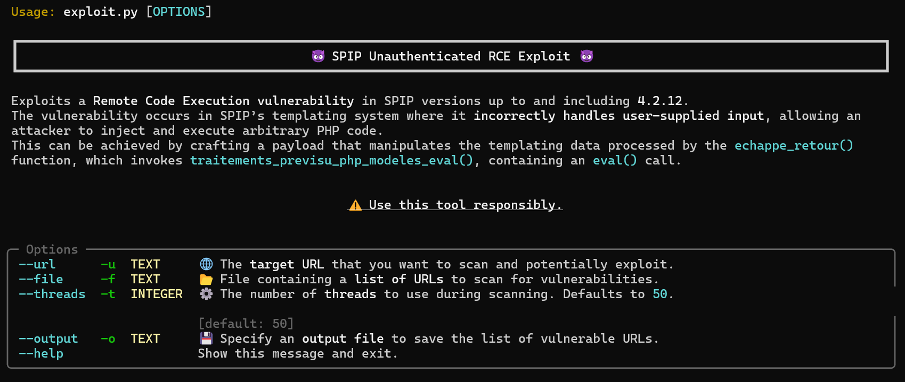

# 🚀 SPIP Unauthenticated RCE Exploit



This repository contains a Python script that exploits a **Remote Code Execution (RCE) vulnerability** in SPIP versions up to and including **4.2.12**. The vulnerability arises from SPIP’s templating system, where it incorrectly handles user-supplied input, allowing an attacker to inject and execute arbitrary PHP code.

## 🛠 Vulnerable Application

The vulnerability is triggered by crafting a payload that manipulates the templating data processed by the `echappe_retour()` function, which in turn invokes `traitements_previsu_php_modeles_eval()`, containing an `eval()` call.

### 🐳 Docker Setup

To set up a vulnerable environment for testing, use the following Docker Compose file:

```yaml
version: '3.8'

services:
  db:
    image: mariadb:10.5
    restart: always
    environment:
      - MYSQL_ROOT_PASSWORD=MysqlRootPassword
      - MYSQL_DATABASE=spip
      - MYSQL_USER=spip
      - MYSQL_PASSWORD=spip
    networks:
      - spip-network

  app:
    image: ipeos/spip:4.2.12
    restart: always
    depends_on:
      - db
    environment:
      - SPIP_AUTO_INSTALL=1
      - SPIP_DB_SERVER=db
      - SPIP_DB_LOGIN=spip
      - SPIP_DB_PASS=spip
      - SPIP_DB_NAME=spip
      - SPIP_SITE_ADDRESS=http://localhost:8880
    ports:
      - 8880:80
    networks:
      - spip-network

networks:
  spip-network:
    driver: bridge
```

### ✅ Verification Steps

1. 🏗 **Set up** a SPIP instance using the provided Docker Compose configuration.
2. 🌐 **Ensure** that the SPIP instance is accessible on your local network.
3. 📂 **Clone** this repository and navigate to the directory containing the Python exploit script.

## 🛠 Usage

To use the Python exploit script, follow these steps:

### 💻 Command Line Options

- `-u` or `--url`: The **🌐 target URL** that you want to scan and potentially exploit.
- `-f` or `--file`: File containing a **📂 list of URLs** to scan for vulnerabilities.
- `-t` or `--threads`: The number of **⚙️ threads** to use during scanning. Defaults to `50`.
- `-o` or `--output`: Specify an **💾 output file** to save the list of vulnerable URLs.

### 🎯 Examples

- **Single URL Exploitation:**

  ```sh
  python exploit.py -u http://localhost:8880
  ```

  This will scan and attempt to exploit the specified target URL.

- **Scanning Multiple URLs:**

  ```sh
  python exploit.py -f urls.txt -t 100 -o results.txt
  ```

  This will scan the URLs listed in `urls.txt`, using 100 threads, and save the vulnerable URLs to `results.txt`.

## 📸 Example Command Output


The above screenshot demonstrates the successful execution of the exploit, displaying the resulting reverse shell or command output from a vulnerable SPIP instance.

## 🛑 _**Use this tool responsibly.**_

This exploit should only be used for educational purposes or on systems you own or have explicit permission to test. Unauthorized use of this tool is illegal and unethical.
